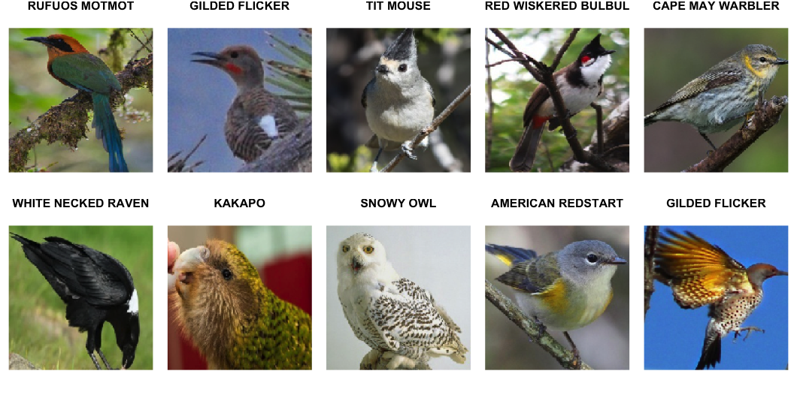

# A Neural Network Approach to Bird Classification

<!-- PROJECT LOGO -->
 
 

  

<small> &#169 <a href="https://www.kaggle.com/gpiosenka/100-bird-species">The World Color Survey</a> </small>

 

## About this project
Paper submitted for the course Datenanalyse II (Data Analytics II).

### Built with

* [R 4.0.3](https://www.r-project.org/)
* [Python 3.6](https://www.python.org/)
* [Tensorflow 2.2.0](https://www.tensorflow.org/)

## Abstract

The avid bird watcher faces a classification problem every single time they find their way into the field: to determine bird species. The goal of this paper is to give a sketch for a deep learning architecture which could be the core of a potential bird identification application. Therefore we compare four different Convolutional Neural Network approaches for building a classifier from scratch: a baseline model; an augmented baseline model; and two types of pretrained networks. 
