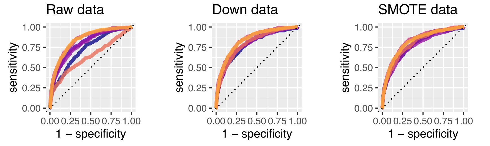

# Area Under the ROC Curve - A Comparison of Performance Metrics for Classification Problems

<!-- PROJECT LOGO -->
 
 

  

 

## About this project
Paper submitted for the course Wirtschaftsinformatik (Information Systems).

### Built with

* [R 4.0.3](https://www.r-project.org/)

## Abstract

The application of Machine Learning (ML) methods to support or automate decision- making is becoming a common tool in Business Intelligence. The evaluation af a ML model relies on which metric is employed to asses the method.  In this paper we examime the use of the single value metric Area Under the ROC Curve (AUC) for the evaluation of machine learning algorithms, particulary looking at AUC as a measure of classifier performance. Our goal is to show that in case of imbalanced data the ROC/AUC metric has some advantageous properties over qualitative classification metrics, especially accuracy. 